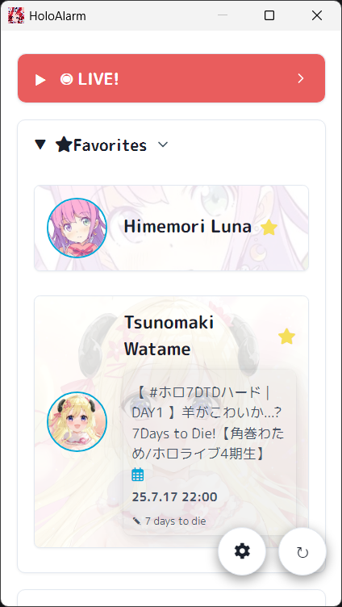
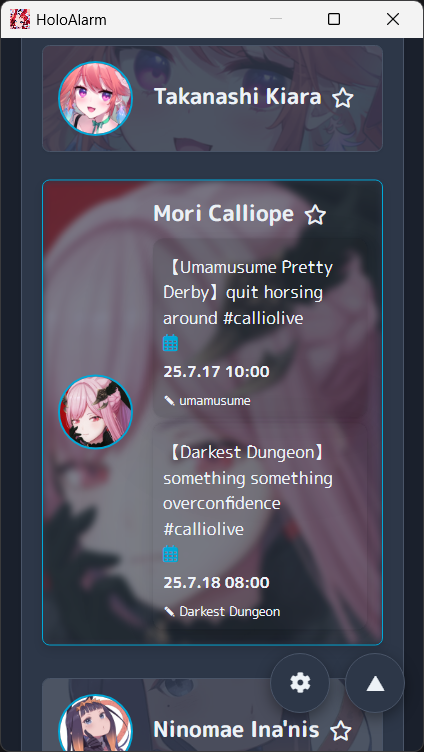

# HoloAlarm

## Overview

HoloAlarm is a desktop application that provides notifications for Hololive live streams. Stay updated with your favorite VTubers and never miss a live stream again.

## Images

Here are some screenshots of the application:

**Live Streams** | **Favorites** | **Dark Mode**   
---|---|---
 |  | 

## Usage

1.  **Get API Key from Holodex:**
    -   Go to the [Holodex](https://holodex.net/) website and log in.
    -   Navigate to the **Account** > **Developer Settings** page.
    -   Click the **"New API Key"** button to generate a new API key.
    -   Copy the generated API key.

2.  **Run the Application and Set API Key:**
    -   When you first run the application, you will be prompted to enter the Holodex API key.
    -   Paste the copied API key into the input field and save.
    -   

## Build and Run

To build and run this application locally, follow these steps:

1.  **Clone the repository:**
    ```bash
    git clone https://github.com/DongInSong/holoalarm.git
    cd holoalarm
    ```

2.  **Install dependencies:**
    ```bash
    npm install
    ```

3.  **Run the application:**
    ```bash
    npm start
    ```

## Release

You can create distributable packages for Windows and Linux using the following commands:

-   **For Windows (x64):**
    ```bash
    npm run build:win64
    ```

-   **For Linux (x64):**
    ```bash
    npm run build:linux64
    ```

The release files will be located in the `dist/` directory.

## License

This application is powered by the [Holodex API](https://holodex.net/).

In compliance with the Holodex API license, this project acknowledges Holodex as the data source and provides a link to their service. The source code includes notices referring to the Holodex Public License and its disclaimer of warranties. We are committed to adhering to their terms of service.
